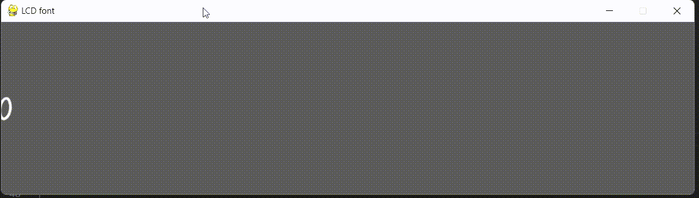
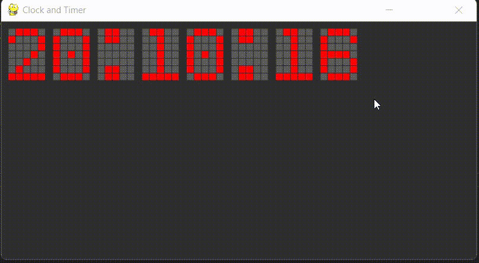

# pygame_samples

 - demo_01.py: pygameの超簡単なデモ。
     -  Step1
 
 - demo_02.py: 7セグのシミュレーション、各セグメントを2ブロックで構成。Seven_segクラス使用。
 - demo_LCD_font_01.py: 5x7のLCDフォント制作用。LCD_fontクラス使用。
     - Step4
 
 - demo_LCD_font.py: 5x7のLCDフォント、完成版。
 - demo_freetype.py: pygame.freetypeでテキスト表示。（新しい方式）
 - demo_freetype.py: pygame.fontでテキスト表示。（古い方式）
 - demo_openmoji.py: オープンソースの絵文字、openmojiのデモ。キー操作のデモ。
 - seven_seg_pg.py: Seven_segクラス
 - lcd_font_pg.py: LCD_fontクラス
 - test1.py: 自作の時計表示。
     - Step5
 